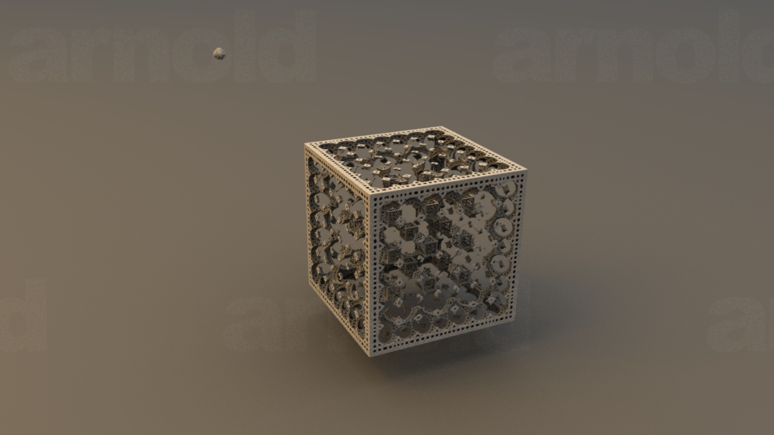

Fractal Experiments
===================
A few of experiments with fractals just for fun (Work In Progress)
Images are generated with Arnold
I also used Arnold procedurals to generate the particles

The code is based on the Arnold procedural Mandelbulb code found here:
http://support.solidangle.com/display/ARP/Large+Datasets+from+Procedurals
 
So far, I only changed the formula, replacing the Mandelbulb formula with a formula 
based on the Mandelbox found here:
http://blog.hvidtfeldts.net/index.php/2011/09/distance-estimated-3d-fractals-v-the-mandelbulb-different-de-approximations/
I also removed the orbitthreshoold parameter and exposed the "limit" parameter to be able to experiment with different values

Early test sample:

